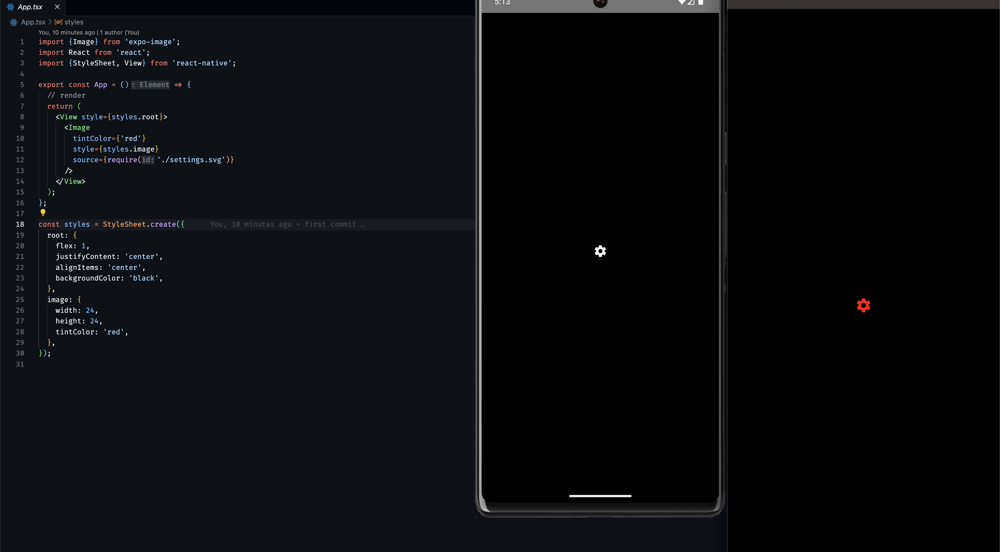

### Expo info

```
  expo-env-info 1.0.5 environment info:
    System:
      OS: macOS 13.4.1
      Shell: 5.9 - /bin/zsh
    Binaries:
      Node: 20.7.0 - ~/Library/Caches/fnm_multishells/31222_1696327275882/bin/node
      Yarn: 1.22.19 - ~/Library/Caches/fnm_multishells/31222_1696327275882/bin/yarn
      npm: 10.1.0 - ~/Library/Caches/fnm_multishells/31222_1696327275882/bin/npm
      Watchman: 2023.09.04.00 - /opt/homebrew/bin/watchman
    Managers:
      CocoaPods: 1.12.1 - /opt/homebrew/bin/pod
    SDKs:
      iOS SDK:
        Platforms: DriverKit 22.4, iOS 16.4, macOS 13.3, tvOS 16.4, watchOS 9.4
      Android SDK:
        Android NDK: 22.1.7171670
    IDEs:
      Android Studio: 2022.3 AI-223.8836.35.2231.10406996
      Xcode: 14.3.1/14E300c - /usr/bin/xcodebuild
    npmPackages:
      expo: ^49.0.13 => 49.0.13 
      react: 18.2.0 => 18.2.0 
      react-native: 0.72.5 => 0.72.5 
    Expo Workflow: bare
    ```
